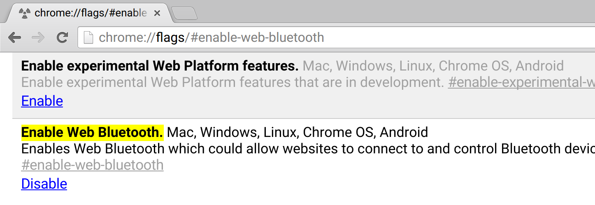

#CoolBeans

Demo of running [noble](https://github.com/sandeepmistry/noble) in a web page. Directly from the web page without websockets or plugins.  It's based on work being done to shim noble on top of the new [Web Bluetooth API](https://webbluetoothcg.github.io/web-bluetooth/)

##Screenshot

##Installation

* clone this repo
* install deps: `npm i`
* build: `npm run build`
* host the project on an https server such as gh-pages.
* Load the page on chromebook running beta channel with web bluetooth enabled:
  

##live demo
[https://monteslu.github.io/coolbeans](https://monteslu.github.io/coolbeans)
