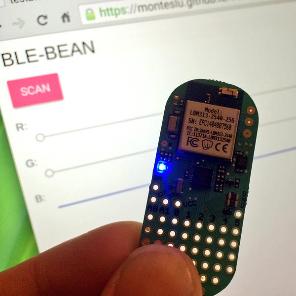

#CoolBeans

Demo of running [noble](git@github.com:monteslu/coolbeans.git) in a web page.

##Screenshot

##Installation

*clone this repo
*install deps: `npm i`
*build: `npm run build`
*host the project on an https server such as gh-pages.

##live demo
[https://monteslu.github.io/coolbeans](https://monteslu.github.io/coolbeans)
